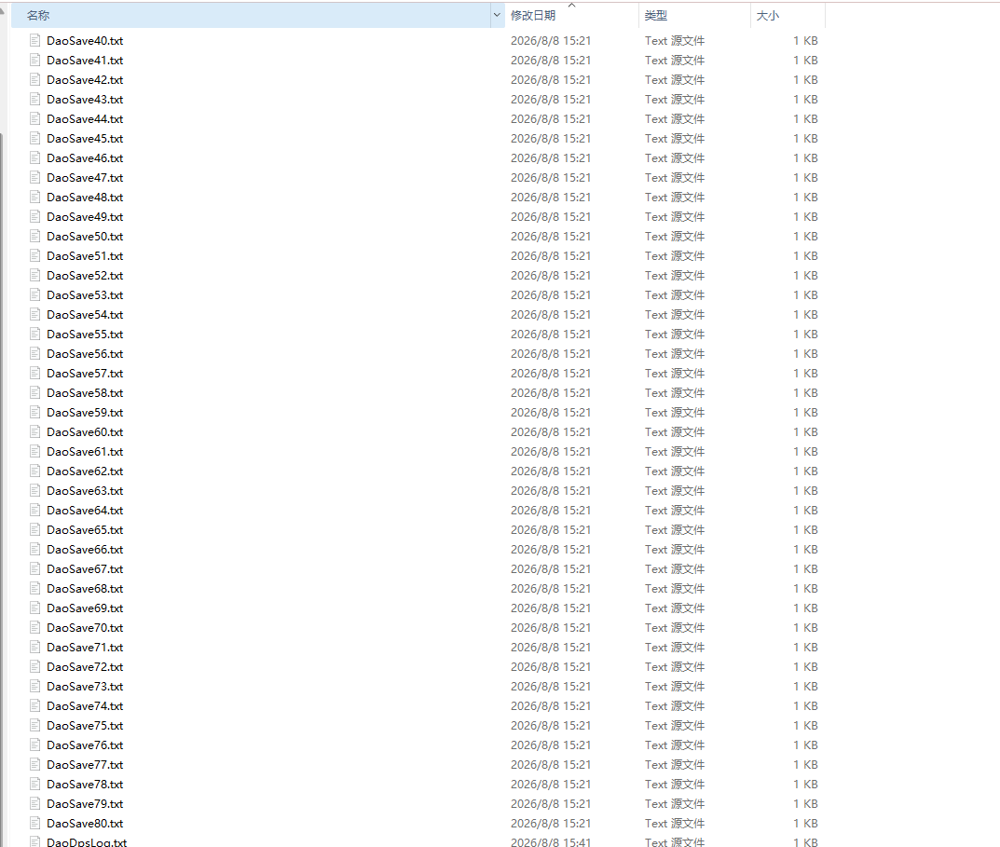

# 存档与读档

> 地图存档用于保存整支队伍的主要进度。它区别于《魔兽争霸 III》自带的游戏存档，是地图单独提供的进度保存功能。所有存档和读档指令都在游戏聊天框中输入，并且只能由玩家 1 操作。

!!! warning "开始前先记住"
    - 新存档会覆盖本机原有的游戏存档文件。如需保留历史进度，请先备份旧文件。
    - 存档数据跟随玩家座位，而不是玩家昵称。读档时请保持与存档时相同的座位顺序。

## 快速使用

### 单人游戏

1. 在队伍状态稳定、没有进行战斗时，由玩家 1 输入 `-save`。
2. 等待游戏提示存档完成后再退出游戏。
3. 下次进入同一版本的地图，等待地图初始化完成。
4. 在选人或继续推进前，由玩家 1 输入 `-load`。
5. 读档期间不要继续操作，等待游戏提示读档完成。

### 多人游戏

1. 所有玩家仍在游戏中时，由玩家 1 输入 `-save`。游戏会在每位玩家自己的电脑上写入一套本地存档。
2. 下次游戏使用相同的地图版本，并保持与存档时相同的玩家座位顺序。
3. 如果更换了电脑、重装了游戏，或使用别人发来的存档，请先把同一整套 81 个存档文件复制到每位玩家的电脑中。
4. 进入地图后，由玩家 1 输入 `-loadcheck`。
5. 确认所有玩家均显示检查通过后，再由玩家 1 输入 `-load`。

!!! danger "多人检查未通过时不要强行读档"
    `-loadcheck` 出现失败，通常表示某位玩家缺少文件、文件内容不同，或者混用了两次不同的存档。先统一所有人的存档文件，再重新检查。

## 指令一览

| 指令 | 用途 | 建议使用时机 |
| --- | --- | --- |
| `-save` | 保存当前队伍进度 | 队伍稳定、脱离战斗后 |
| `-load` | 读取本地存档并重建队伍进度 | 地图刚开始、尚未手动选人或推进时 |
| `-loadcheck` | 检查多人之间的本地存档是否一致 | 多人读档前必须执行 |
| `-savediag` | 生成更详细的存档诊断信息 | 需要进一步排查时使用 |

## 什么时候适合存档

建议在以下情况下存档：

- 队伍已经脱离战斗，场上没有正在结算的技能。
- 所有需要继续游玩的玩家都还在游戏中。
- 没有正在播放的重要剧情或过场。
- 队伍中的临时变身、临时白字属性加成等效果已经结束。

如果队伍中仍有临时白字属性效果，或装备尚未归还，地图会拒绝本次存档。按照屏幕提示处理后，再次输入 `-save` 即可。

不建议在 Boss 战斗中、技能大量结算时或剧情播放期间存档。

## 存档会保存什么

存档主要包含：

- 六个玩家座位上的英雄、等级、永久属性、复活次数、金币和木材。
- 英雄的位置、物品与数量、最大生命值和当前生命值。
- 已获得的雇佣兵、宠物及其物品。
- 地面上的主要物品、已经开启的宝箱和部分关卡进度。
- 商店限购数量及部分重要 Boss 状态。

以下状态不会原样保存：

- 当前魔法值。
- 技能冷却、正在施放的技能和临时增益。
- 个别物品或技能在本场游戏中临时积累的层数。
- 正在进行中的 Boss 战斗细节。
- 更多无法还原的临时细节。

因此，读档后看到魔法值、冷却或临时效果重置属于正常情况。为了减少差异，请尽量在脱离战斗后存档。

## 本地存档文件在哪里

存档位于平台实际启动的《魔兽争霸 III》目录下：

```text
<实际启动的魔兽争霸 III 文件夹>\Logs\
```

当前版本的一套存档固定包含 81 个文件：`DaoSave.txt`，以及从 `DaoSave1.txt` 连续编号到 `DaoSave80.txt` 的 80 个文件。

```text
Warcraft III\
└─ Logs\
   ├─ DaoSave.txt
   ├─ DaoSave1.txt
   ├─ DaoSave2.txt
   ├─ ...
   └─ DaoSave80.txt
```

受《魔兽争霸 III》地图文件操作限制，当前存档会固定保留 81 个文件用于分块存放。大部分情况下，编号较大的文件可能只有约 1 KB，这是正常现象；备份、转移或替换时仍要从 `DaoSave.txt` 一直完整处理到 `DaoSave80.txt`，不能省略。



*示例：`Logs` 目录中的存档文件会连续编号到 `DaoSave80.txt`，编号较大的文件显示为 1 KB 属于正常情况。*

!!! tip "找不到正在使用的魔兽目录？"
    进入地图执行一次 `-save`，然后在磁盘中搜索 `DaoSave.txt`，按修改时间排序。刚刚更新的文件所在目录，就是本次游戏实际使用的 `Logs` 目录。

## 如何备份、转移或替换存档

### 备份当前存档

1. 等待 `-save` 提示完成，然后完全退出《魔兽争霸 III》。
2. 打开实际游戏目录中的 `Logs` 文件夹。
3. 找到 `DaoSave.txt` 以及从 `DaoSave1.txt` 到 `DaoSave80.txt` 的全部编号文件。
4. 确认共 81 个文件后，将它们一起压缩保存或发送给其他玩家。

### 更换电脑或使用别人发来的存档

1. 完全退出《魔兽争霸 III》。
2. 如需保留当前进度，先备份 `Logs` 文件夹中的旧存档。
3. 将收到的 81 个文件完整复制进实际游戏目录的 `Logs` 文件夹，保持文件名不变，并覆盖旧的同名文件。
4. 多人游戏时，在每位玩家的电脑上重复以上操作，确保所有人使用完全相同的一套文件。
5. 使用相同版本的地图，并按原来的玩家座位顺序进入。
6. 进图菜单点击完毕后，由玩家 1 输入 `-loadcheck`；确认所有玩家均通过后，再输入 `-load`。

!!! warning "不要混用或手动编辑存档"
    不要只替换 `DaoSave.txt`，也不要只复制其中一部分编号文件，或把两次存档的文件混在一起。不要重命名或修改文件内容，否则检查或读档可能失败。

## 常见问题

### 输入 `-save` 或 `-load` 没有反应

确认指令由玩家 1 输入，前后不要添加空格。其他座位输入这些指令不会执行存档或读档。

### 提示存档文件缺失或损坏

先确认 `Logs` 目录中同时存在 `DaoSave.txt` 和 `DaoSave1.txt` 到 `DaoSave80.txt`，共 81 个文件，并检查是否混用了不同存档。仍无法解决时，输入 `-savediag` 检查本机读写功能。

### 多人只有部分玩家检查失败

失败玩家通常没有放入完整文件，或文件并非来自同一次存档。重新把同一整套文件复制到所有玩家电脑后，再执行 `-loadcheck`。

### 读档后角色数据到了另一个玩家身上

存档按玩家座位恢复。退出后按存档时的座位顺序重新进入，再执行读档。

### 无法确定原因

输入 `-savediag`。如果诊断功能已加载，详细报告会生成在：

```text
<实际启动的魔兽争霸 III 文件夹>\Logs\DaoSaveDiagnostic.txt
```

提交问题时，最好同时说明地图版本、单人或多人、玩家座位顺序、屏幕提示，以及是否更换过存档文件。
