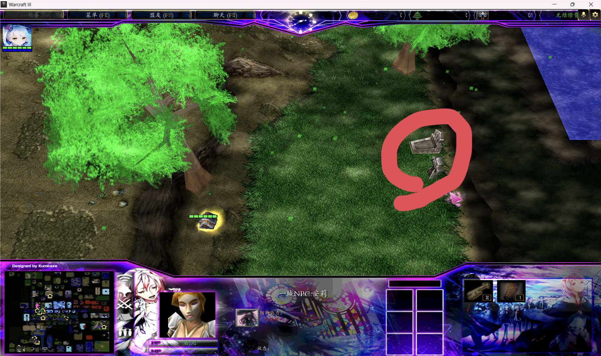
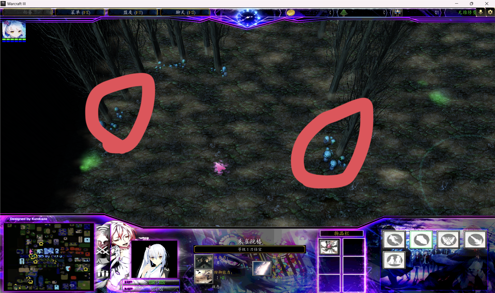
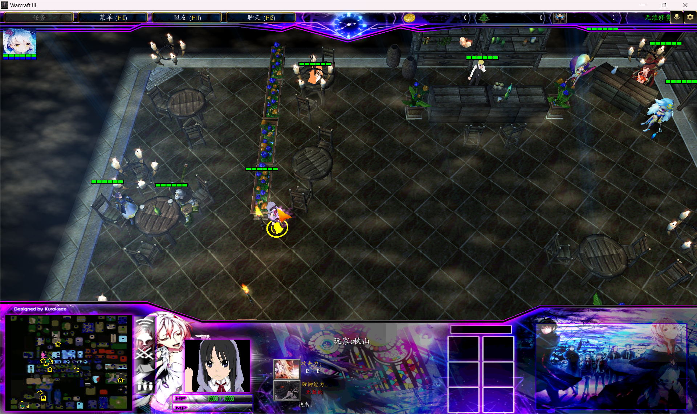

# 料理任务

> 来源：`料理配方位子和任务.docx`。本页整理料理配方任务的接取位置、完成条件和相关 NPC/商店提示。

## 最终奖励

完成整条料理任务后获得 [`I0MC` 随身佳肴](../items/不归类/I0MC_随身佳肴.md)。

| 奖励道具 | 主要效果 |
|---|---|
| [`I0MC` 随身佳肴](../items/不归类/I0MC_随身佳肴.md) | 全属性 +200；主动使用后随机触发回血回蓝、临时全属性、护甲/魔抗、移动速度等料理效果 |

## 过程解锁

| 任务 | 过程中解锁/获得 |
|---|---|
| 烤肉排配方任务 | [`I0PA` 食物:烤肉排](../items/消耗物品/I0PA_食物_烤肉排.md) 配方 |
| 第二份料理配方 | [`I0PB` 食物:精巧蛋糕](../items/消耗物品/I0PB_食物_精巧蛋糕.md) 配方 |
| 第 3 份配方 | [`I0PC` 食物:草莓奶昔](../items/消耗物品/I0PC_食物_草莓奶昔.md) 配方 |
| 第 4 份配方 | [`I0P7` 食物:小鸡炖蘑菇](../items/消耗物品/I0P7_食物_小鸡炖蘑菇.md) 配方 |
| 第 5 份配方 | [`I0P8` 食物:啤酒鸭](../items/消耗物品/I0P8_食物_啤酒鸭.md) 配方 |
| 第 6 份配方 | [`I0P9` 食物:雪兔煲](../items/消耗物品/I0P9_食物_雪兔煲.md) 配方 |
| 第 7 份配方 | [`I0P6` 食物:药酒](../items/消耗物品/I0P6_食物_药酒.md) 配方 |

## 料理任务接取处

## 烤肉排配方任务

- 带 5 份狼肉、5 份猪肉交给 NPC，完成任务后赠送配方。
- 奖励：解锁 [`I0PA` 食物:烤肉排](../items/消耗物品/I0PA_食物_烤肉排.md) 配方。
- 相关任务物品：[`I0MD` 任务:烤肉排](../items/特殊/I0MD_任务_烤肉排.md)。

!!! note "食材提示"
    这里的小鸡可以杀死获得鸡肉，小鸡会复活。

## 第二份料理配方位置

- 在此处购买奶油、鸡蛋、草莓、美味调料包。
- NPC 赠送配方。
- 奖励：解锁 [`I0PB` 食物:精巧蛋糕](../items/消耗物品/I0PB_食物_精巧蛋糕.md) 配方。

## 第 3 份配方

- 在安娜处购买 10 束鲜花，看望墓碑后获得。
- 奖励：解锁 [`I0PC` 食物:草莓奶昔](../items/消耗物品/I0PC_食物_草莓奶昔.md) 配方。

## 第 4 份配方

- 在堕落天使 NPC 处接取 8 层蘑菇精任务。
- 采集 10 个蘑菇会出现蘑菇怪 Boss。
- 打败蘑菇怪 Boss 后，将其掉落的蘑菇精交给 NPC 获得配方。
- 奖励：解锁 [`I0P7` 食物:小鸡炖蘑菇](../items/消耗物品/I0P7_食物_小鸡炖蘑菇.md) 配方。

## 第 5 份配方

- 在此处接取“请客包场”。
- 到酒保处点击“请全场”，花费 30000 金币。
- 请完客后获得配方；该 NPC 之后会出售啤酒。
- 奖励：解锁 [`I0P8` 食物:啤酒鸭](../items/消耗物品/I0P8_食物_啤酒鸭.md) 配方。
- 相关解锁物品：[`I0N3` 挥霍一下,请客请全场](../items/特殊/I0N3_挥霍一下请客请全场.md)。

## 第 6 份配方

- 给六花打造一套趁手装备。
- 武器需求由 25 层火花之石打造。
- 需要携带火花之冠.提升（防具打造）、火花之刃.提升（武器打造）、火花吊坠.提升（饰品打造）。
- 将这 3 件装备带给六花后获得配方；六花会出售萝卜、雪兔肉、生姜。
- 奖励：解锁 [`I0P9` 食物:雪兔煲](../items/消耗物品/I0P9_食物_雪兔煲.md) 配方。

## 第 7 份配方

- 通关 35 层后，在老鬼处接取任务。
- 去酒保处购买 1 份普通酒水带给他。
- 完成后获得配方；老鬼会出售药材。
- 奖励：解锁 [`I0P6` 食物:药酒](../items/消耗物品/I0P6_食物_药酒.md) 配方。

