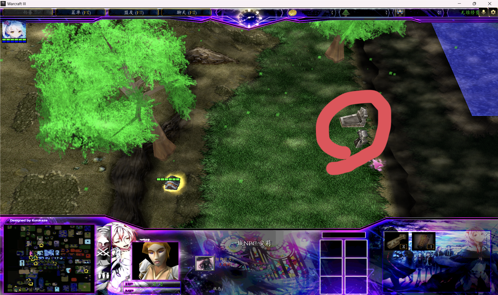
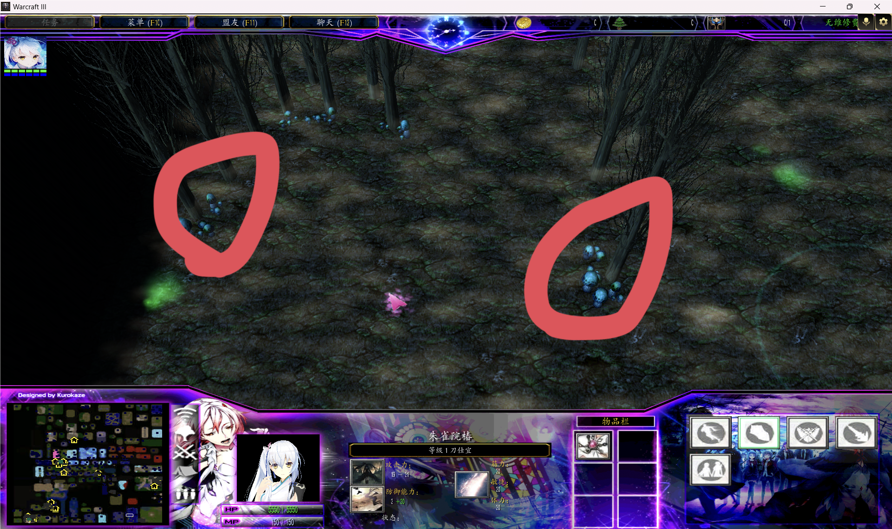
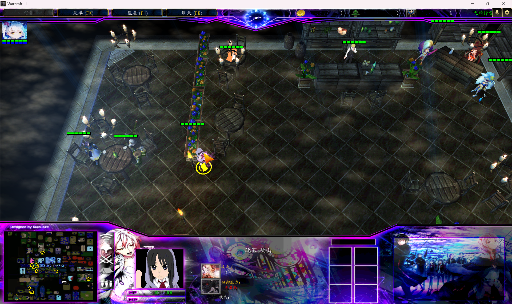

# 料理任务

> 本页已按 2.5 的任务结果与料理配方重新核对。任务解锁条件和实际料理材料不能混为一谈。

## 总流程与最终奖励

1. 在料理任务 NPC 处点击 [`I0MB` 任务:美食料理](../items/特殊/I0MB_任务_美食料理.md) 接取总任务。
2. 完成下方7份配方任务。每完成一份，任务进度+1；全部完成后即可领奖。
3. 再次点击 `I0MB`，获得 [`I0MC` 随身佳肴](../items/不归类/I0MC_随身佳肴.md)，总任务状态改为已领奖，不能重复领取。

| 奖励道具 | 当前主要效果 |
|---|---|
| [`I0MC` 随身佳肴](../items/不归类/I0MC_随身佳肴.md) | 全属性 +200；主动能力冷却 18 秒，随机触发持续回血回蓝、临时全属性、护甲/魔抗或移动速度效果 |

## 七份配方任务

| 顺序 | 解锁料理 | 当前任务交付条件 |
|---:|---|---|
| 1 | [`I0PA` 食物:烤肉排](../items/消耗物品/I0PA_食物_烤肉排.md) | 点击 `I0MD` 时交付 `I0ME` 野猪肉 ×5 + `I009` 野狼肉 ×5 |
| 2 | [`I0PB` 食物:精巧蛋糕](../items/消耗物品/I0PB_食物_精巧蛋糕.md) | 总任务已接取后，至少各购买一次 `I0MI` 奶油、`I0MK` 鸡蛋、`I0MJ` 草莓、`I0MS` 调料包 |
| 3 | [`I0PC` 食物:草莓奶昔](../items/消耗物品/I0PC_食物_草莓奶昔.md) | 携带 `I0N0` 鲜花至少 10 份进入指定墓碑矩形；触发后扣除 10 份 |
| 4 | [`I0P7` 食物:小鸡炖蘑菇](../items/消耗物品/I0P7_食物_小鸡炖蘑菇.md) | 接取 `I0N2` 后在第 8 层累计击杀 10 只蘑菇，击杀刷出的 `n03E` 蘑菇怪，取得并交付 `I0N1` 蘑菇精 |
| 5 | [`I0P8` 食物:啤酒鸭](../items/消耗物品/I0P8_食物_啤酒鸭.md) | 在酒保处购买 `I0N3`“请全场”，花费 30000 金 |
| 6 | [`I0P9` 食物:雪兔煲](../items/消耗物品/I0P9_食物_雪兔煲.md) | 点击 `I0NG` 时同时交付 `I0N4` 火花之刃·提升、`I0N5` 火花之冠·提升、`I0N7` 火花吊坠·提升 |
| 7 | [`I0P6` 食物:药酒](../items/消耗物品/I0P6_食物_药酒.md) | 点击 `I0NH` 时交付 `I07I` 任务酒水 ×1 |

!!! danger "第 7 份任务不是交普通酒水"
    任务完成分支明确检查 `I07I`，不是 `I0PI` 普通酒水。`I0PI` 只出现在药酒的**实际合成公式**中；旧页把二者混成同一个物品是错误的。

## 实际料理合成公式

任务完成只保存“配方已解锁”状态；真正做料理仍按下表消耗材料。

| 料理 | 2.5 当前实际材料 |
|---|---|
| [`I0PA` 食物:烤肉排](../items/消耗物品/I0PA_食物_烤肉排.md) | [`I009` 野狼肉](../items/素材/I009_野狼的肉.md) ×1 + [`I0ME` 野猪肉](../items/素材/I0ME_野猪的肉.md) ×1 + [`I0MG` 孜然粉](../items/素材/I0MG_孜然粉.md) ×1 |
| [`I0PB` 食物:精巧蛋糕](../items/消耗物品/I0PB_食物_精巧蛋糕.md) | [`I0MI` 奶油](../items/素材/I0MI_奶油.md) ×3 + [`I0MJ` 草莓](../items/素材/I0MJ_草莓.md) ×1 + [`I0MK` 鸡蛋](../items/素材/I0MK_鸡蛋.md) ×3 |
| [`I0PC` 食物:草莓奶昔](../items/消耗物品/I0PC_食物_草莓奶昔.md) | [`I0MJ` 草莓](../items/素材/I0MJ_草莓.md) ×1 + [`I0MX` 水果](../items/素材/I0MX_水果.md) ×1 + [`I0MW` 牛奶](../items/素材/I0MW_牛奶.md) ×1 |
| [`I0P7` 食物:小鸡炖蘑菇](../items/消耗物品/I0P7_食物_小鸡炖蘑菇.md) | [`I0MH` 鸡肉](../items/素材/I0MH_鸡肉.md) ×1 + [`I0MR` 蘑菇](../items/素材/I0MR_蘑菇.md) ×3 + [`I0MS` 调料包](../items/素材/I0MS_调料包.md) ×1 |
| [`I0P8` 食物:啤酒鸭](../items/消耗物品/I0P8_食物_啤酒鸭.md) | [`I0MQ` 鸭子](../items/素材/I0MQ_鸭子.md) ×1 + [`I0MT` 啤酒](../items/素材/I0MT_啤酒.md) ×1 + [`I0MS` 调料包](../items/素材/I0MS_调料包.md) ×1 |
| [`I0P9` 食物:雪兔煲](../items/消耗物品/I0P9_食物_雪兔煲.md) | [`I0MY` 萝卜](../items/素材/I0MY_萝卜.md) ×3 + [`I0MU` 雪兔肉](../items/素材/I0MU_雪兔肉.md) ×1 + [`I0MV` 生姜](../items/素材/I0MV_生姜.md) ×1 |
| [`I0P6` 食物:药酒](../items/消耗物品/I0P6_食物_药酒.md) | [`I0H7` 小型体力药水](../items/消耗物品/I0H7_小型体力药水.md) ×1 + [`I00F` HP小型恢复药水](../items/消耗物品/I00F_HP小型恢复药水.md) ×1 + [`I0PI` 普通酒水](../items/素材/I0PI_普通酒水.md) ×1 |

!!! warning "当前配方的两个异常现象"
    这些使用 3 类材料的配方成功时会生成 **3 件结果物品**。药酒旧资料虽然还列出 `I0MZ` 药材 ×1，但当前实际配方只消耗前三种材料，`I0MZ` 不会被消耗。

## 任务位置图

### 总任务接取处

### 第 1 份：烤肉排

!!! note "食材提示"
    附近小鸡死亡会掉鸡肉，并在 10 秒后重新生成；这部分是第 4 份料理的合成食材来源，不是第 1 份任务交付物。

### 第 2 份：精巧蛋糕

### 第 3 份：草莓奶昔

### 第 4 份：小鸡炖蘑菇

### 第 5 份：啤酒鸭

### 第 6 份：雪兔煲

### 第 7 份：药酒

